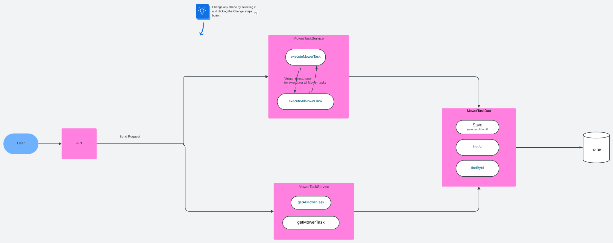

# Publicis_Sapient_test
This repo contains my results for the test proposed by Publicis Sapient

## Requirements
This project is programmed in Java and uses certain features of **Java 21**, which you will need to have in order to run the project, [the link install java 21](https://ubuntuhandbook.org/index.php/2022/03/install-jdk-18-ubuntu/)

You will also need **Maven**, which is used to build and manage the project.

To simplify the execution of the application on various environments, we have conteunerised the application and created an image that has been pushed to Docker Hub, so it will be possible to download this image and run it.

In this version, we have also chosen to provide the user with the option of sending the various tasks + mowers rather than reading a configuration file + Use H2 database.
## Structure
Create à N-tier java application that retrieve data from file inside _**src/main/resources/mowerTasksConfigurations**_ , the application has 3 layer:
- Models: This layer content data models that will be use in the application
  - _**InstructionEnum**_ : It is use to encapsulates all possible values of instruction that can be used to move the mower
  - _**Mower**_ : Class which will represent the mower itself, mainly its position, orientation at a given time and the size of the lawn which must not be exceeded.
  - _**MowerTask**_ : This class will be used to associate a mower (its position) and the instructions associated with it, also the initial position of the mower and its final position after execution of the tasks.
  - _**Orientation**_ : It is use to encapsulates all possible values of orientation that can be used for a mower
  - _**Ground**_ : allows you to model the terrain on which the mowers operate


- Persistence: This layer is use to separate the data persistence logic in a separate layer, the date will be retreive from file, it contains an interface **_MowerDao_** which has the functions:
  - _**List<MowerTask> findAll()**_: It will take the name of the configuration file containing the data and return the list of MowerTask (mower position + instructions).
  - _**MowerTask save(MowerTask mowerTask)**_: get all mower tasks present in the DB.
  - _**Optional<MowerTask> findById(String mowerTaskId)**_: get a mower tasks from the DB.

- Service: Layer where there is the business logic is implement, it contains an interface **_MowerService_** which has the functions:
  - _**void executeAllMowerTask(MowerTasksDto mowerTasksDto)**_: Use to execute the MowerTask(mower position + instructions) send by the API, here we're going to use virtual threads to execute all differents tasks assynchronously.
  - _**List<MowerTask> getAllMowerTask()**_: get all mower tasks present in the DB
  - _**MowerTask getMowerTask(String mowerTaskId)**_: get a mower tasks from the DB.


- presentation: Here we're going to use the **_MowerScreen_** class to retrieve the user's inputs

Currently the application just print Article by seller with price in seller currency.


## Technical information
It uses the following specs:
- Uses the **spring** framework (mainly to manage the lifecycle of our objects) and **spring boot** to configure the spring framework
- AssertJ + Junit 5 + Mockito to test and get better assertions
- logback for logging

## Run information
To run the application, you can use IDE that will be able to run the java programs, built with Maven or build the jar and run with command land or use Docker image yald/mower-task:1.0.0.

- Use the IDE


- To date it is possible to create an uber jar with maven:
  
  ```$ mvn package -f pom.xml```

  ```$ java -jar --enable-preview target/Tondeuse-1.0-SNAPSHOT.jar```


- Use Docker image

  ```$ docker run -p 8009:8009 yald/mower-task:1.0.0```


    NB: you will need to be connected to docker hub registry before you can launch the image, as you will need to download the image from docker hub.
    $ docker login
    Build docker image :
    $ mvn package -f pom.xml
    $ docker build -tmower-task:1.0.0 . 


Once the application is running, you can send the instructions + mower via API Rest in the format below

```
URI: http://localhost:8009/api/mower/tasks

{
"ids": ["1", "2"],
"ground":"5 5",
"mowerAndInstructions": ["1 2 N;GAGAGAGAA", "3 3 E;AADAADADDA"]
} 
```
The tasks are put in the form "positionMower;Instruction", all the Tasks on the same lawn are in a list at the level of the argument mowerAndInstructions.

To have the various tasks present in our database and the result of its denier it make the following request.
```
URI: http://localhost:8009/api/mower/tasks

Result:
[
    {
        "id": "1",
        "instructions": "GAGAGAGAA",
        "initalPosition": "1 2 N",
        "finalPosition": "1 3 N",
        "mower": {
            "id": "f3c822af-d4ac-4ee4-876d-ca53e12e19f4",
            "orientation": "N",
            "ground": {
                "id": "78d86935-0e06-4b2d-9793-77537c8d8b02",
                "topRightCorner": 5,
                "lowerLeftCorner": 5
            },
            "xposition": 1,
            "yposition": 3
        }
    },
    {
        "id": "2",
        "instructions": "AADAADADDA",
        "initalPosition": "3 3 E",
        "finalPosition": "5 1 E",
        "mower": {
            "id": "0cd7c9f8-7368-402f-b1ac-d20df494d592",
            "orientation": "E",
            "ground": {
                "id": "d049721d-c2f5-4020-a25b-08e0650b33be",
                "topRightCorner": 5,
                "lowerLeftCorner": 5
            },
            "xposition": 5,
            "yposition": 1
        }
    }
]


URI: http://localhost:8009/api/mower/tasks/1

Result:
{
    "id": "1",
    "instructions": "GAGAGAGAA",
    "initalPosition": "1 2 N",
    "finalPosition": "1 3 N",
    "mower": {
        "id": "f3c822af-d4ac-4ee4-876d-ca53e12e19f4",
        "orientation": "N",
        "ground": {
            "id": "78d86935-0e06-4b2d-9793-77537c8d8b02",
            "topRightCorner": 5,
            "lowerLeftCorner": 5
        },
        "xposition": 1,
        "yposition": 3
    }
}
```

## Go Further 
To go further, we could :

- Make a dto to present the result at the get level

- To be able to launch tasks on different lawns at the same time

- Use a database to store the positions of the mowers, to make the project more reliable.

- We could also use a message bus to send instructions, where our service will read the instructions as they come in, making it easy to scale the application.
