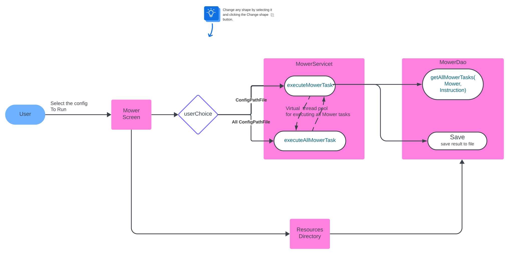
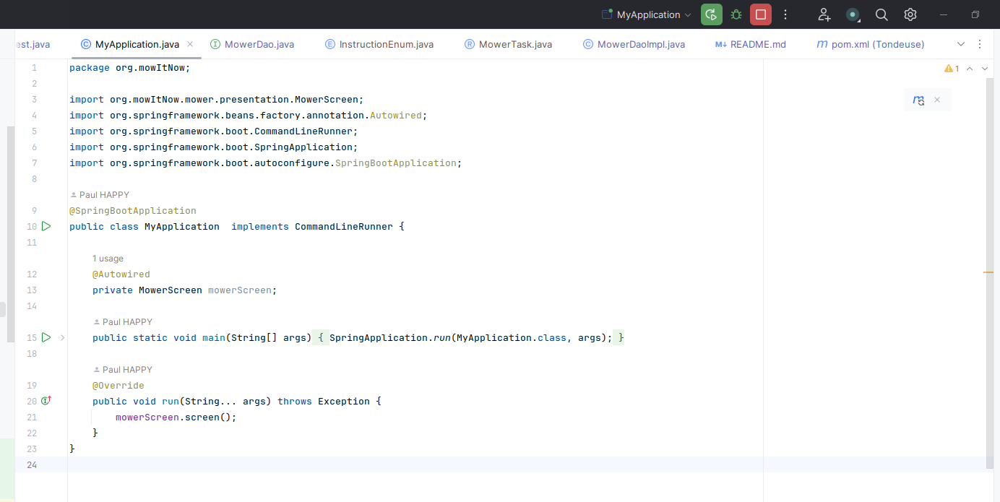
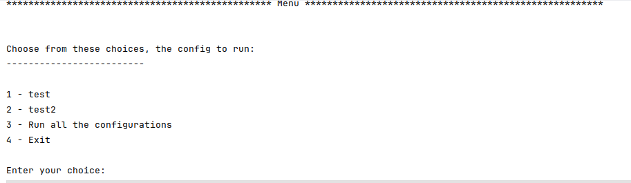

# Publicis_Sapient_test
This repo contains my results for the test proposed by Publicis Sapient

## Requirements
This project is programmed in Java and uses certain features of **Java 21**, which you will need to have in order to run the project, [the link install java 21](https://ubuntuhandbook.org/index.php/2022/03/install-jdk-18-ubuntu/)

You will also need **Maven**, which is used to build and manage the project.

## Structure
Create à N-tier java application that retrieve data from file inside _**src/main/resources/mowerTasksConfigurations**_ , the application has 3 layer:
- Models: This layer content data models that will be use in the application
  - _**InstructionEnum**_ : It is use to encapsulates all possible values of instruction that can be used to move the mower
  - _**Mower**_ : Class which will represent the mower itself, mainly its position, orientation at a given time and the size of the lawn which must not be exceeded.
  - _**MowerTask**_ : This class will be used to associate a mower (its position) and the instructions associated with it from the configuration file.
  - _**Orientation**_ : It is use to encapsulates all possible values of orientation that can be used for a mower


- Persistence: This layer is use to separate the data persistence logic in a separate layer, the date will be retreive from file, it contains an interface **_MowerDao_** which has the functions:
  - _**List<MowerTask> getAllMowerTasks(String fileName)**_: It will take the name of the configuration file containing the data and return the list of MowerTask (mower position + instructions).
  - _**void save(String content, String filePath)**_: Will take the result of a series of executions and the path where to write the result.


- Service: Layer where there is the business logic is implement, it contains an interface **_MowerService_** which has the functions:
  - _**void executeMowerTask(String fileName)**_: Use to execute the MowerTask(mower position + instructions) stored in the same file
  - _**void executeAllMowerTask(List<String> fileNames)**_: Here we're going to use virtual threads to execute all the files in the directory _**src/main/resources/mowerTasksConfigurations**_ assynchronously.


- presentation: Here we're going to use the **_MowerScreen_** class to retrieve the user's inputs

Currently the application just print Article by seller with price in seller currency.


## Technical information
It uses the following specs:
- Uses the **spring** framework (mainly to manage the lifecycle of our objects) and **spring boot** to configure the spring framework
- AssertJ + Junit 5 + Mockito to test and get better assertions
- logback for logging

## Run information
To run the application, you need an IDE that will be able to run the java programs, built with Maven.



Run the MyApplication main class, where you will see a menu offering different configurations to run



To add a new configuration you need to add a file in the directory _**src/main/resources/mowerTasksConfigurations**_ that contains the following information 

_size of the lawn_

_mower position_

_instruction_


Result are in folder **/target/classes/results/**


## Go Further 
To go further, we could :


- To date it is possible to create an uber jar with maven, but it would be necessary to change the function of reading and writing file to allow the jar to write / read on an external file (Not had with the time to go further)
  
    ```$ mvn package assembly:single```

    ```$ java -jar --enable-preview  target/Tondeuse-1.0-SNAPSHOT-jar-with-dependencies.jar```


- Use a database to store the positions of the mowers, to make the project more reliable.


- We could also use a message bus to send instructions, where our service will read the instructions as they come in, making it easy to scale the application.


- Have a REST API


